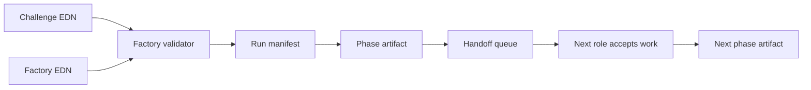

# Design Notes

## Source Ideas

See [`charter.md`](charter.md) for the product mission and
[`roadmap.md`](roadmap.md) for staged milestones.

SwarmForge contributes the operational shape:

- project-local roles
- explicit role ownership
- a file-backed handoff protocol
- local state under a hidden runtime directory
- work split by phase rather than one large agent context

rama-ai-learn contributes the Rama development shape:

- challenge contracts
- phased artifacts
- adversarial validation phases
- explicit PState, depot, query, partitioning, fault-tolerance, and performance concerns
- private-test-style thinking where the blueprint must state more than the happy path

## Runtime Flow



## Devenv And Worktrees

Devenv should be the outer developer-experience layer. It installs the local
toolchain, exposes named tasks, supervises noninteractive processes, and runs
tests. The factory stays responsible for the role topology, Rama workflow
metadata, artifact gates, and handoff semantics.

## Dogfood Seed Labs

See [`dogfood-seed-system.html`](dogfood-seed-system.html) for the visual plan.

Generated apps are useful evidence that a seed works, but they should not appear
as accidental untracked directories at the factory repo root. The seed system
should grow a lab layer:

- `factory/seeds/<seed>` remains the tracked source package.
- `factory/projects.edn` registers managed project workpieces and their ports,
  paths, installed seeds, personas, and status.
- `factory/seed-labs/<lab>.edn` describes a dogfood scenario, source seeds,
  validation commands, and commit evidence.
- `.rama-workspaces/<lab>` is ignored by the factory repo and can be a generated
  app with its own git history.
- `examples/<lab>` is reserved for curated, known-good snapshots that are worth
  showing to open-source users.

The practical loop is: generate a lab app, commit the baseline, let agents work
inside the lab, validate the app, checkpoint the evidence, then decide whether
to promote changes back into the seed, publish an example, keep the work
app-specific, or reject it with a report.

SwarmForge contributes the worktree model:

- one role can run in the main checkout
- implementation and review roles run in `.worktrees/<role>`
- each role has an agent backend, worktree name, and receive mode
- durable handoff files move work between roles
- git commit handoffs let recipients review, merge, or continue from a stable
  state

The practical boundary is:

- `devenv.nix` owns Clojure, Babashka, tmux, git, Node, process supervision,
  readiness checks, and task names.
- `factory/factory.edn` owns the role order, worktree names, phase owners, and
  Rama validation gates.
- `.worktrees/` contains mutable per-role git checkouts and stays ignored.
- `.rama-factory/` contains Rama Factory runtime state and generated handoff
  state.

Current non-destructive inspection commands:

```bash
clojure -M:factory swarm-plan
clojure -M:factory swarm-config
```

The next step is an explicit `swarm-prepare` command that creates the planned
git worktrees, writes per-role runtime files, and refuses to run when the main
checkout has uncommitted changes that would make role branches ambiguous.

## Validation Rules

The validator is intentionally conservative:

- every phase owner must be a configured role
- phase ids must be unique
- every phase must have a visible artifact
- every PState must declare a partition key
- growing PStates must be subindexed or explicitly bounded
- every query must declare its routing and expected I/O
- write topologies must state retry/fault-tolerance behavior

These checks do not prove a Rama module is correct. They catch the common planning omissions that make a real Rama implementation expensive to repair later.

## Why EDN

The factory config and challenge blueprint are EDN because the target system is Clojure-first. The data can be read directly by agent runners, tests, generators, and future Rama tooling without a translation layer.

The same rule applies to extensions. The first draft extension manifest is
`factory/extensions/auth.edn`, which is intentionally structured as data so
validators, generators, docs, and agent skills can consume it without a custom
translation layer.
